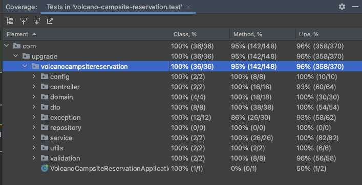

# Campsite reservation

## Description of the challenge

Back-end Tech Challenge: Campsite reservation REST API service

An underwater volcano formed a new small island in the Pacific Ocean last month. All the conditions on the island seems
perfect, and it was decided to open it up for the public to experience the pristine uncharted territory.

The island is big enough to host a single campsite so everybody is very excited to visit. In order to regulate the
number of people on the island, it was decided to come up with an online web application to manage the reservations. You
are responsible for design and development of a REST API service that will manage the campsite reservations.

To streamline the reservations a few constraints need to be in place

- The campsite will be free for all.
- The campsite can be reserved for max 3 days.
- The campsite can be reserved minimum 1 day(s) ahead of arrival and up to 1 month in advance.
- Reservations can be cancelled anytime.
- For sake of simplicity assume the check-in & check-out time is 12:00 AM

### System Requirements

- The users will need to find out when the campsite is available. So the system should expose an API to provide
  information of the availability of the campsite for a given date range with the default being 1 month.
- Provide an end point for reserving the campsite. The user will provide his/her email & full name at the time of
  reserving the campsite along with intended arrival date and departure date. Return a unique booking identifier back to
  the caller if the reservation is successful.
- The unique booking identifier can be used to modify or cancel the reservation later on. Provide appropriate end
  point(s) to allow modification/cancellation of an existing reservation
- Due to the popularity of the island, there is a high likelihood of multiple users attempting to reserve the campsite
  for the same/overlapping date(s). Demonstrate with appropriate test cases that the system can gracefully handle
  concurrent requests to reserve the campsite.
- Provide appropriate error messages to the caller to indicate the error cases.
- In general, the system should be able to handle large volume of requests for getting the campsite availability.
- There are no restrictions on how reservations are stored as long as system constraints are not violated.

### Notes

Things to keep in mind while you're working on the challenge are tech stack (utilizing things like Java and Spring Boot),
concurrency solution (handling multiple instances/requests), concurrency/integration/unit test coverage, scalability,
exception handling, validations, code structure, packaging/division, separation between entity and dto, 
controller advice with good http status and error msgs, readme/documentation, etc.

## Documentation

The campsite-reservation service is written in java 11 with Spring Boot.

This is a simple REST API service with H2 database accessed via spring-boot-data-jpa.

### Open source technologies

- **Java 11**
- **Gradle 7.4** to build
- **Lombok** to generate boilerplate code
- **Spring Boot** (spring-web, spring-webmvc, spring-data-joa)
- **Swagger** to document the REST API and to test
- **H2** for simplicity's sake we used this as our database (We can use postgres if we were to fully implement this)
- **Mockito** for unit test
- **Assertj** for the unit test assertions

### Packages and Classes

The main package is `com.upgrade.volcanocampsitereservation`.

#### Subpackage `dto`

The `BookingDto` class contains the properties:
- id (primary key)
- version (serves as an optimistic lock value. The version is used to ensure integrity when performing the merge
  operation and for optimistic concurrency control).
- email
- fullName
- arrivalDate
- departureDate

The `BookingDateDto` entity has one field `date` which is the primary key.

#### Subpackage `repository`

Each volcano campsite reservation is represented by an entity `BookingDto` and managed by the interface
`BookingRepository` (which is a `JpaRepository`).

Each reserved campsite date is represented by an entity `BookingDateDto` and managed by the interface
`BookingDateRepository` (which is also a `JpaRepository`). 

#### Subpackage `service`

The class `BookingService` contains the logic of the reservation system and allows the usage of transactions.

#### Subpackage `controller`

The `BookingController` manages the REST API. The POJO `Booking` is used in requests and responses, in 
addition to the class `java.time.LocalDate` which is used to represent the dates.

#### Subpackage `domain`

The `Booking` class contains the properties:
- id
- email
- fullName
- arrivalDate
- departureDate

See the section [About dates](#about-dates).

### Subpackage `validation`

`BookingGuideLine` is an annotation which defines the constraints on the `Booking` class. The component `BookingValidator`
executes the validation logic and reports appropriate error message when the constraints are violated.

### Subpackage `exception`

This package contains the declaration of 3 custom exception classes that extends `RuntimeException`:
- `BookingConflictException`
- `BadRequestException`
- `BookingNotFoundException`

See the section [Exception handling](#exception-handling).

### About dates

For sake of simplicity we assume the check-in & check-out time is 12:00 AM, so we don't need to store the time.
The class `java.time.LocalDate` is used everywhere to manipulate the date.

A reservation with an arrival date 2022-04-14 at 12:00 AM and a departure date 2022-04-17 at 12:00 AM is represented
by a `Booking` object with fields `arrivalDate = LocalDate("2022-04-14")` and `departudeDate = LocalDate("2022-04-17")`.

In terms of availabilities, the start date is included, and the end date is excluded. In the above example, it means
the days 2022-04-14, 2022-04-15, and 2022-04-16 are booked and 2022-04-17 is available.

### Configuration

There are 3 custom configurations:
```yaml
campsite:
  max-reserved-days: 3
  min-days-ahead-of-arrival: 1
  reservation-max-days-in-advance: 31
```
- `campsite.max-reserved-days` specifies the maximum number of days a user can reserve.
- `campsite.min-days-ahead-of-arrival` specifies the minimum number of days before the arrival date of a booking.
- `campsite.reservation-max-days-in-advance` specifies the maximum number of days before the arrival date of a booking.

### Validation

Input data validation is separated from the controller and the model via annotations. The annotation `@BookingGuideLine`
is applied on the Booking object, and the validation is executed by the component `BookingValidator`.

Other standards validation annotations are used like `@Email`, `@Future`, `@NonBlank`, and `@NonNull`.

### Exception handling

The class `BookingControllerAdvice` is a `@ControllerAdvice` that declares several exception handlers. Error are returned
to the REST API user via a json string, and an appropriate status code.

Example of json error response:
```json
{
    "message": "Invalid date 'FEBRUARY 30'",
    "status": "BAD_REQUEST"
}
```

HTTP status code that can be returned:
- 404 NOT_FOUND in case a booking by id cannot be found
- 409 CONFLICT in case a booking conflicts with another booking
- 400 BAD_REQUEST when request parameters or request json body are invalid
- 500 INTERNAL_SERVER_ERROR for other types of error

### REST API design

6 operations are exposed on the endpoint (detailed in the section [Internal logic, transaction and concurrency](#internal-logic-transaction-and-concurrency)).
- `GET /availabilities`: Get information of the availability of the campsite for a given date range with the default being 1 month.
  This operation returns the list of available dates.
  2 optional request parameters `startDate` and `endDate` can be used to specify the date range. The default value for `startDate` is the current day.
  The default value for `endDate` is 1 month since the start date.
- `GET /bookings`: Get the list of all reservations.
- `GET /booking/{id}`: Get the information of the reservation with the given id.
- `POST /booking`: Reserve the campsite with the information of the json body:
  ```json
  {
    "email": "someEmail@gmail.com",
    "fullName": "Full Name",
    "arrivalDate": "2022-04-17",
    "departureDate": "2022-04-20"
  }
  ```
- `PUT /booking/{id}`: Update the reservation with the given id with the information of the json body (see above).
- `DELETE /booking/{id}`: deletes the reservation with the given id.

### Internal logic, Transaction and Concurrency

#### GET /availabilities - getAvailabilitiesBetween(startDate, endDate)

logic:
- List all the dates between startDate and endDate -> list1
- With the `BookingDateRepository`, find all dates between startDate and endDate -> list2
- Remove all elements of list2 from list1.
- Return list1.

This logic is in the method `BookingService#getAvailabilities()` which is annotated with `@Transactional(readOnly = true)`.
It is a readonly transaction because it does not modify the values.

#### GET /bookings - getBookingList

This operation also uses a readonly transaction to find all booking from the `Booking` table sorted by arrival dates.

#### GET /bookings/{id} - getBooking(id)

This operation also uses a readonly transaction to find by id 1 booking from the `Booking` table.

#### POST /bookings - addBooking(booking)

This operation needs to be protected against concurrent access. A simple mutex cannot work when there
are multiple replicas of the application. I used several mechanisms. First, the `BookingService#add()` method
is annotated with `@Transactional(isolation = Isolation.SERIALIZABLE)` which prevents against dirty reads, 
phantom reads and non-repeatable read.

The logic is:
- Find all reserved date in the `BookingDateDto` table between the arrival date and the departure date.
  This method is annotated with `@Lock(LockModeType.PESSIMISTIC_WRITE)` which allows using *select for update*.
  It can throw a CannotAcquireLockException in case of concurrent access on the same rows. 
- If at least 1 date is booked within this time range, throws AlreadyBookedException.
- Otherwise, save all the date within this time range in the `BookingDateDto` table. This can throw
  a DataIntegrityViolationException in case 
- Save the booking in the `Booking` table. This method is annotated with `@Lock(LockModeType.PESSIMISTIC_FORCE_INCREMENT)`
  which implements a pessimist write lock with version update. Indeed, the `BookingDto` contains a version field
  to protect against concurrent updates.

In general, a TransientDataAccessException can be thrown indicating that the operation might be able to succeed
if it is retried.

#### PUT /bookings/{id} - updateBooking(id, booking)

Updating a booking is very similar to the creation of a booking. The only difference is that the booking dates
of the old booking are deleted before calling `addBooking(booking)`. The method `BookingService#update()` is also annotated
with `@Transactional(isolation = Isolation.SERIALIZABLE)`.

#### DELETE /bookings/{id} - deleteBooking(id)

In a regular transaction (`isolation.DEFAULT`), the booking dates, and the booking entity are deleted.

### Scalability and availability

The design of this system permits to have multiple replicas of the Spring Boot java component, thus giving high availability and scalability.

### Unit tests and Code coverage

The code is covered at 95% by unit tests.



- The `BookingValidatorTest` class tests the validation of the constraints.
- The `BookingcontrollerTest` class tests the REST API with `MockMvc`. The repository classes are mocked.
- The `BookingServiceTest` class tests the `BookingService`, and the repository classes using an H2 in-memory database.
- The `BookingServiceConcurrencyTest` class contains special tests for testing concurrent access, using an H2 in-memory
  database. Test are written with an `ExecutorService` that submit 2 tasks. A delay is artificially added to make sure the second
  task is executed in the middle of the first task. This tests guarantees that the transactions are correctly managed.
  See the section [Transactions](#internal-logic-transaction-and-concurrency).

### How to execute

#### Locally

Run:

```shell
./gradlew bootRun
```

Swagger UI is embedded and available at http://localhost:8080/swagger-ui.html.

### Tests using [httpie](https://httpie.io/)

Some sample requests:

```shell
URL=http://localhost:8080
http $URL/bookings
http $URL/availabilities
http -v POST $URL/bookings fullName="Joshua Chan-Fee" email="joshuachanfee@gmail.com" arrivalDate='2022-05-01' departureDate='2022-05-03'
http $URL/bookings
http $URL/bookings/1
http -v PUT $URL/bookings/1 fullName="Joshua Chan-Fee" email="joshuachanfee@gmail.com" arrivalDate='2022-05-02' departureDate='2022-05-03'
http $URL/bookings/1
http DELETE $URL/bookings/1
```

### Campsite reservation examples

```json
[
  {
    "email": "joshuachanfee@gmail.com",
    "fullName": "Joshua Chan-Fee",
    "arrivalDate": "2022-04-17",
    "departureDate": "2022-04-20"
  },
  {
    "email": "johnDoe@gmail.com",
    "fullName": "John Doe",
    "arrivalDate": "2022-04-28",
    "departureDate": "2022-04-30"
  },
  {
    "email": "janeDoe@gmail.com",
    "fullName": "Jane Doe",
    "arrivalDate": "2022-05-08",
    "departureDate": "2022-05-11"
  }
]
```

### Swagger

Swagger UI, accessible at http://localhost:8080/swagger-ui.html can be used
to read the REST API documentation and execute some requests.

### Testing with Postman

Once the application is up and running you can test with Postman

### H2 console

H2-console can be enabled with the property `spring.h2.console.enabled=true` and accessible at http://localhost:8080/h2-console/.

### Known limitations

1. Using h2 in-memory as my database:
  - With h2, I needed to add `@Transactional(isolation = Isolation.SERIALIZABLE)` to prevent concurrent creation of booking.
  - Adding `@Transactional(isolation = Isolation.SERIALIZABLE)` is not perfect because it also prevents concurrent creation of bookings
    that are not in conflict. 
  - The H2 documentation says: "Serializable: Dirty reads, non-repeatable reads, and phantom reads aren't possible.
    Note that this isolation level in H2 currently doesn't ensure equivalence of concurrent and serializable execution of transactions."
  - If I had more time, I would use a postgres database run in a docker image instead of h2 in-memory.